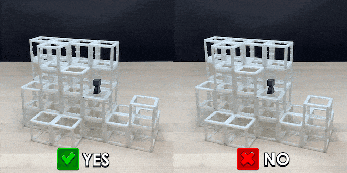

Link: https://www.kickstarter.com/projects/magnetcubes/magnetcubes-cubeclimbers-board-game-motorized-liftpack

*Progress so far*  
`1. GameManager to manage a session - done` 
`2. Initialise players - done` 
`3. Initialise board - done` 
`4. Initialise power cards, colours and additional description - done` 
`5. Build action implementation - done` 
`6. Validate input position values for performing build action - done` 
`7. Implement rules as per the rulebook - done` 
`8. Move action implementation - done` 
`9. Suggest position values for performing move action - done` 
`10. Implement rules as per the rulebook - in progress` 
`11. Roll dice action implementation - in progress` 
`12. Validate input position values for performing roll action - in progress` 
`13. Implement rules as per the rulebook - in progress` 

CubeClimbers is a strategy game for 2-4 players where you compete for the highest spot of a mountain by stacking MagnetCubes, pushing opponents, using grappling hooks, and unleashing magic powers. With precision, ingenious tactics, and a dash of luck, you might just claim the top!

Play on a dynamic 3D mountain made of magnetic building blocks
Move and build tactically to climb and block your opponents
Activate magic powers for game-changing outplays! Over 100 unique asymmetric player power combinations
Amazing table presence— each game ends with a unique structure
Simple rules with endless depth and strategy

Contents: 

68 MagnetCubes

8 Climbers

1 Engraved Jumbo Die (25mm)

4 Stands (for Meeples)

16 Unique Power Cards

The player at the highest level at the end of the game wins!

Build a mountain of cubes as you play

Each game ends with a unique structure held together by magnets!

During their turn, players BUILD, MOVE, and ROLL. Players must perform all three actions once in any order to end their turn and may also use powers as optional actions. The game keeps going until the player who builds the last remaining cube ends their turn.

EXAMPLE OF TURNS:

Good climbing relies on foresight and creative order of operations to get to the best space!

Build 2 Cubes consecutively by stacking them anywhere on the mountain

MagnetCubes are elegant building blocks that magnetically snap together. Building with them results in unique spatial configurations every turn. You can build MagnetCubes to create steps for yourself or to block opponents.

Move to an adjacent space

*Spaces are adjacent in cardinal directions across all levels, but NOT diagonally
Move to any space along the same level or up and down one adjacent space. Climb too high and you might find yourself on a ledge, but climb too safe and get overtaken. Remember, each action is mandatory so planning ahead is key to avoiding missteps.

no glue, no clips, just magnets!
*TIP: Thanks to the power of magnetism, you can move the entire tower around to get a better view of all your available spaces. (Try playing on a Lazy Susan or turntable for a streamlined experience)

Roll and perform the indicated action

Grapple to climb 1 or 2 adjacent spaces ahead. The grappling hook is a great tool for additional repositioning, but it's hard to aim so it'll only hook half of the time!

Wind places all players in a cardinal direction of your choice. Use wind to push opponents of ledges and take the lead!

Each player is dealt 2 of the 16 unique powers for over one hundred asymmetric player power combinations.

Powers can be used as additional game-changing actions to outplay opponents, but can only be used once a game. Ingenious and well-timed usage will make all the difference!

Multiple game modes to keep things fresh! See Variants section in rulebook for details.

Play a set of games and score points based on the level you end on at the end of each game!

Work with your partner to outclimb the other team!

Deal as many power cards as you want to each player. Go crazy!

Get creative with different starting base configurations, combine variant modes, use more MagnetCubes to play with more than 4 players, and implement your own house rules!
